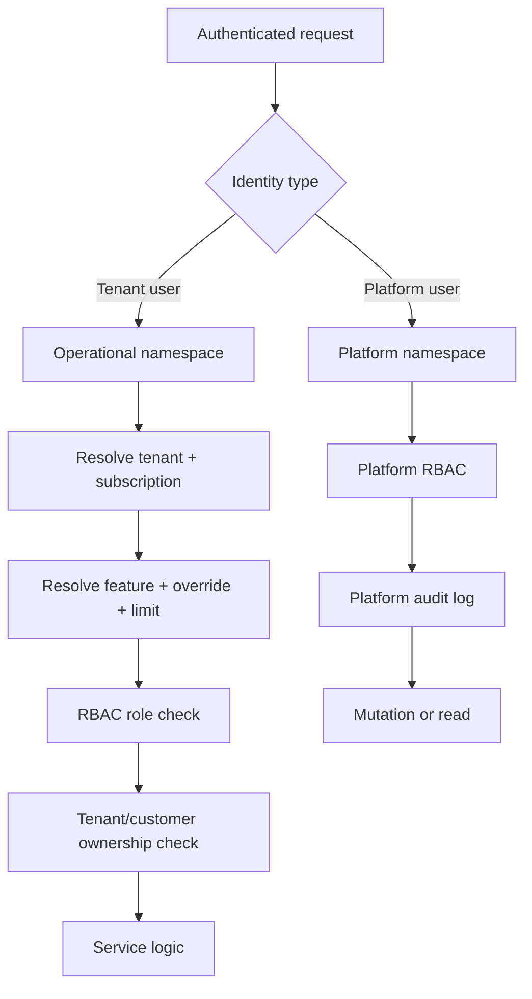

# Platform Entitlements and Super Admin V1

## 1. Context

FreightFlow currently operates as a tenant-scoped SaaS backend where operational users, customer users, JWT claims, repositories, and most service methods assume a concrete `tenantId`.

As of Saturday, August 1, 2026, the backend already supports:

- tenant registration through `/api/v1/auth/register`;
- tenant-bound internal roles: `ADMIN`, `OPERATOR`, `VIEWER`;
- tenant-bound external role: `CLIENT`;
- tenant-aware filtering in operational modules such as shipments, events, alerts, documents, voyages, commercial RFQs, and quotations;
- a basic tenant plan string on `tenants.plan`;
- customer scoping for `CLIENT` users.

It does not yet support:

- platform-level identities;
- platform-level endpoints;
- centralized feature entitlements;
- subscription lifecycle management;
- per-tenant feature overrides;
- usage-limit enforcement;
- platform audit logs.

This document defines the V1 architectural direction for:

- contracted plans;
- tenant entitlements and module availability;
- usage limits;
- plan overrides;
- trial, suspension, and subscription state;
- platform Super Admin;
- future integration with RBAC, CLIENT portal, booking, and billing.

This is a specification-only round. No production code, migrations, entities, or public endpoints are changed by this document.

## 2. Current State Proven by Code

### 2.1 Tenant and user identity

Evidence:

- [Tenant.java](/C:/Users/kauec/projects/freightflow-api/src/main/java/com/freightflow/modules/auth/Tenant.java)
- [User.java](/C:/Users/kauec/projects/freightflow-api/src/main/java/com/freightflow/modules/auth/User.java)
- [V1__create_tenants_table.sql](/C:/Users/kauec/projects/freightflow-api/src/main/resources/db/migration/V1__create_tenants_table.sql)
- [V8__create_users_and_api_keys_tables.sql](/C:/Users/kauec/projects/freightflow-api/src/main/resources/db/migration/V8__create_users_and_api_keys_tables.sql)

Observed facts:

- `Tenant` has `active` and `plan` columns.
- `Tenant.plan` is a plain string, not a normalized subscription model.
- `User.tenant` is `@JoinColumn(name = "tenant_id", nullable = false)`.
- `tenant_id` in `users` is `NOT NULL` since V8.
- `UserRole` only contains `ADMIN`, `OPERATOR`, `VIEWER`, `CLIENT`.
- `CLIENT` can carry `customer_id`; other roles usually do not.
- There is no current concept of a platform-only user table.

### 2.2 JWT and authenticated principal

Evidence:

- [UserPrincipal.java](/C:/Users/kauec/projects/freightflow-api/src/main/java/com/freightflow/shared/security/UserPrincipal.java)
- [JwtTokenProvider.java](/C:/Users/kauec/projects/freightflow-api/src/main/java/com/freightflow/shared/security/JwtTokenProvider.java)
- [JwtAuthenticationFilter.java](/C:/Users/kauec/projects/freightflow-api/src/main/java/com/freightflow/shared/security/JwtAuthenticationFilter.java)
- [AuthService.java](/C:/Users/kauec/projects/freightflow-api/src/main/java/com/freightflow/modules/auth/AuthService.java)

Observed facts:

- `UserPrincipal` requires `tenantId` in its constructor.
- access tokens always emit `tenantId`.
- `JwtTokenProvider.getUserPrincipalFromClaims()` always parses `tenantId`.
- refresh tokens only store `subject` and `type=refresh`, then reload the user from the database.
- `AuthService.buildAuthResponse()` always constructs principals from `user.getTenant().getId()`.
- there is no safe authenticated path today for a user without tenant context.

### 2.3 RBAC

Evidence:

- [RequiresRole.java](/C:/Users/kauec/projects/freightflow-api/src/main/java/com/freightflow/shared/rbac/RequiresRole.java)
- [RoleCheckAspect.java](/C:/Users/kauec/projects/freightflow-api/src/main/java/com/freightflow/shared/rbac/RoleCheckAspect.java)
- [SecurityConfig.java](/C:/Users/kauec/projects/freightflow-api/src/main/java/com/freightflow/config/SecurityConfig.java)

Observed facts:

- authorization is split between Spring Security authentication and an AOP role gate.
- `@RequiresRole` compares string roles directly from `UserPrincipal`.
- the role layer does not understand plans, features, limits, or platform identities.
- there is no `@RequiresFeature` equivalent yet.

### 2.4 Administrative surface

Evidence:

- [AuthController.java](/C:/Users/kauec/projects/freightflow-api/src/main/java/com/freightflow/modules/auth/AuthController.java)
- [UserController.java](/C:/Users/kauec/projects/freightflow-api/src/main/java/com/freightflow/modules/auth/UserController.java)

Observed facts:

- `/api/v1/auth/register` creates a new tenant and its first tenant `ADMIN`.
- `/api/v1/users/**` is tenant-admin only, not platform-admin.
- there is no `/api/v1/platform/**`.
- there is no tenant CRUD controller, no tenant suspension endpoint, and no platform operator panel.

### 2.5 Tenant-aware data access

Observed repository and service pattern:

- operational modules usually resolve entities with `findByIdAndTenantId(...)`;
- `CLIENT` flows often add `customerId` filtering, for example `findByIdAndTenantIdAndCustomerId(...)`;
- services commonly branch on `customerId != null` to apply customer scoping;
- many controllers pass `user.getTenantId()` directly into services.

Representative evidence:

- [ShipmentService.java](/C:/Users/kauec/projects/freightflow-api/src/main/java/com/freightflow/modules/shipment/service/ShipmentService.java)
- [ShipmentRepository.java](/C:/Users/kauec/projects/freightflow-api/src/main/java/com/freightflow/modules/shipment/repository/ShipmentRepository.java)
- [QuotationRepository.java](/C:/Users/kauec/projects/freightflow-api/src/main/java/com/freightflow/modules/commercial/quotation/QuotationRepository.java)
- [RfqRepository.java](/C:/Users/kauec/projects/freightflow-api/src/main/java/com/freightflow/modules/commercial/rfq/RfqRepository.java)
- [DocumentService.java](/C:/Users/kauec/projects/freightflow-api/src/main/java/com/freightflow/modules/document/DocumentService.java)
- [EventService.java](/C:/Users/kauec/projects/freightflow-api/src/main/java/com/freightflow/modules/event/EventService.java)

This is a strong sign that a platform identity must not silently reuse regular repositories with null tenant semantics.

### 2.6 Seeds and plans

Evidence:

- [V12__seed_demo_data.sql](/C:/Users/kauec/projects/freightflow-api/src/main/resources/db/migration/V12__seed_demo_data.sql)
- [V16__rbac_roles_and_permissions.sql](/C:/Users/kauec/projects/freightflow-api/src/main/resources/db/migration/V16__rbac_roles_and_permissions.sql)
- [V24__normalize_dev_demo_users.sql](/C:/Users/kauec/projects/freightflow-api/src/main/resources/db/migration/V24__normalize_dev_demo_users.sql)

Observed facts:

- demo tenant is seeded with `plan='PROFESSIONAL'`.
- the plan string currently behaves as descriptive seed data only.
- there is no normalized catalog of plans, features, trials, or subscription states.
- V24 normalizes demo users only in `freightflow_dev`; it is not a platform bootstrap mechanism.

### 2.7 Cache, metrics, OpenAPI, and audit baseline

Evidence:

- [CacheConfig.java](/C:/Users/kauec/projects/freightflow-api/src/main/java/com/freightflow/config/CacheConfig.java)
- [application.yml](/C:/Users/kauec/projects/freightflow-api/src/main/resources/application.yml)
- [OpenApiConfig.java](/C:/Users/kauec/projects/freightflow-api/src/main/java/com/freightflow/config/OpenApiConfig.java)

Observed facts:

- Redis cache exists for AIS and dashboard caches, not for entitlements yet.
- Actuator exposes `health`, `info`, and `metrics`.
- OpenAPI is configured globally with bearer auth.
- there is no centralized audit log table.
- current "audit-like" behavior is fragmented:
  - `User.lastLoginAt`;
  - soft delete comments in documents;
  - service logs.

## 3. Answers to the Mandatory Current-Identity Questions

1. Does every current `User` require tenant?
   Yes. Both entity mapping and database schema require non-null `tenant_id`.

2. Is `tenant_id` nullable?
   No in `users`, `shipments`, `documents`, `customers`, and most operational ownership points inspected.

3. Is current `ADMIN` necessarily linked to a tenant?
   Yes. `ADMIN` is just one value of `UserRole` and still requires `tenant_id`.

4. Does JWT always require `tenantId`?
   Yes for access tokens and reconstructed principals.

5. Is there a safe way today to authenticate a user without tenant?
   No. The current auth pipeline assumes tenant-bound identity end-to-end.

6. Is there a platform panel or platform endpoint?
   No.

7. Is there a concept of active/blocked tenant?
   Partially. `Tenant.active` exists, but there is no consistent enforcement layer across all authenticated requests.

8. Is there subscription, plan, or feature flag support?
   Only a plain `tenants.plan` string. No real entitlement model exists.

9. Is there a reusable audit trail?
   No centralized reusable audit subsystem was found.

10. Is there risk that a Super Admin inherits incorrect tenant scope?
    Yes, high risk if implemented inside the current `User` + `UserPrincipal` model without a separate boundary.

## 4. Identity Decision for Super Admin

## 4.1 Evaluated alternatives

### Option A: add `SUPER_ADMIN` to current `UserRole`

Pros:

- smallest visible schema delta;
- reuses login, JWT, and `UserPrincipal`.

Cons:

- super admin would still require `tenant_id`;
- existing code constantly passes `user.getTenantId()` into repositories and services;
- many operational endpoints would accidentally accept `SUPER_ADMIN` if role annotations drift;
- cross-tenant access bugs become more likely because services assume tenant context is always operational context;
- null-tenant variant of this option would require breaking entity constraints and many call sites.

Assessment:

- isolation between tenants: weak
- impact on JWT: high-risk semantic overload
- impact on repositories: very high
- leakage risk: high
- complexity: deceptively high
- bootstrap: easy
- recovery and maintenance: poor

### Option B: allow `User` without tenant

Pros:

- keeps one identity table.

Cons:

- directly conflicts with current entity mapping and database constraints;
- would force nullable `tenant_id` across auth assumptions;
- many controllers and services would need null-aware branching;
- high chance of accidental global access or null-pointer behavior.

Assessment:

- isolation: poor
- impact on JWT: breaking
- impact on repositories: breaking
- leakage risk: very high
- complexity: very high

### Option C: create separate platform identity, for example `platform_users`

Pros:

- clean boundary between platform administration and tenant operations;
- avoids polluting tenant repositories with global bypass logic;
- allows distinct JWT claims and authentication namespace;
- platform tokens can be rejected from operational endpoints by default;
- support access can later become explicit and auditable, not implicit.

Cons:

- adds a second identity type;
- requires separate auth path and endpoint namespace;
- needs explicit audit and bootstrap design.

Assessment:

- isolation: strong
- impact on JWT: controlled and explicit
- impact on repositories: low in operational paths
- leakage risk: lowest among practical in-project options
- complexity: moderate and worthwhile

### Option D: external IdP or control plane

Pros:

- strongest long-term separation;
- can centralize MFA, lifecycle, and support operations.

Cons:

- much larger rollout;
- adds operational dependency not present today;
- slows V1 delivery.

Assessment:

- strong strategic option, but too heavy for V1.

### Option E: hybrid platform identity plus explicit support sessions

This is an extension of Option C:

- `platform_users` for platform authentication;
- optional future support-session table to grant temporary scoped access into one tenant;
- no permanent cross-tenant operational principal.

This is the recommended evolution path, but V1 can start with the identity half only.

## 4.2 Recommended option for V1

Recommended: Option C, evolving to Option E later.

Decision:

- do not add `SUPER_ADMIN` to the existing `UserRole` enum in V1;
- do not make `users.tenant_id` nullable;
- create a separate platform identity model and explicit `/api/v1/platform/**` surface;
- require explicit tenant targeting for platform actions;
- keep operational repositories fail-closed and tenant-bound.

## 4.3 Why `SUPER_ADMIN` on `User` is rejected for V1

- It silently couples platform administration to tenant context.
- It encourages bypass logic in common repositories and services.
- It makes accidental access to operational endpoints more likely.
- It creates ambiguity between "tenant admin" and "platform admin".
- It weakens the existing mental model that every operational principal belongs to exactly one tenant.

## 5. Domain Model Proposal

## 5.1 Core concepts

- `PlatformUser`: identity that administers the SaaS platform itself.
- `SubscriptionPlan`: reusable commercial blueprint.
- `PlanEntitlement`: what a plan grants by feature or limit.
- `TenantSubscription`: the active commercial lifecycle of a tenant.
- `TenantEntitlementOverride`: explicit deviation from plan defaults.
- `TenantUsageCounter`: measured usage for enforceable limits.
- `PlatformAuditLog`: immutable platform-side audit trail.

## 5.2 Key distinction

- RBAC answers: "what may this authenticated user do in their allowed context?"
- entitlements answer: "is this tenant commercially and operationally allowed to use this capability?"

Both are required. Neither replaces the other.

## 6. Proposed Data Schema

Names below follow current naming tendencies:

- snake_case tables in Flyway;
- UUID primary keys;
- `created_at` and `updated_at`;
- explicit foreign keys;
- status columns as strings with check constraints or enum mapping.

## 6.1 `platform_users`

Purpose:

- separate platform operator identity from tenant-bound `users`.

Columns:

- `id UUID PK`
- `email VARCHAR(255) UNIQUE NOT NULL`
- `password_hash VARCHAR(255) NOT NULL`
- `name VARCHAR(255) NOT NULL`
- `role VARCHAR(50) NOT NULL`
- `active BOOLEAN NOT NULL DEFAULT TRUE`
- `last_login_at TIMESTAMP NULL`
- `created_at TIMESTAMP NOT NULL`
- `updated_at TIMESTAMP NOT NULL`

Notes:

- V1 can start with a single role such as `PLATFORM_ADMIN`.
- no `tenant_id`.
- soft delete should be modeled through `active`, not hard delete.

Indexes:

- unique on `email`
- index on `active`

## 6.2 `subscription_plans`

Purpose:

- catalog of sellable plans.

Columns:

- `id UUID PK`
- `code VARCHAR(50) UNIQUE NOT NULL`
- `name VARCHAR(120) NOT NULL`
- `status VARCHAR(20) NOT NULL`
- `description TEXT NULL`
- `is_custom BOOLEAN NOT NULL DEFAULT FALSE`
- `created_at TIMESTAMP NOT NULL`
- `updated_at TIMESTAMP NOT NULL`

Suggested status values:

- `ACTIVE`
- `INACTIVE`
- `ARCHIVED`

Notes:

- `code` examples: `STARTER`, `PROFESSIONAL`, `ENTERPRISE`, `CUSTOM`, `LEGACY`.

## 6.3 `plan_entitlements`

Purpose:

- define which feature or limit a plan grants.

Columns:

- `id UUID PK`
- `plan_id UUID NOT NULL FK -> subscription_plans(id)`
- `feature_key VARCHAR(80) NOT NULL`
- `grant_type VARCHAR(20) NOT NULL`
- `enabled BOOLEAN NULL`
- `limit_value BIGINT NULL`
- `config_json JSONB NULL`
- `created_at TIMESTAMP NOT NULL`
- `updated_at TIMESTAMP NOT NULL`

Grant types:

- `BOOLEAN`
- `LIMIT`

Constraints:

- unique `(plan_id, feature_key)`
- if `grant_type='BOOLEAN'`, `enabled` must be non-null
- if `grant_type='LIMIT'`, `limit_value` must be non-null and non-negative

Indexes:

- index on `plan_id`
- index on `feature_key`

## 6.4 `tenant_subscriptions`

Purpose:

- commercial lifecycle assigned to a tenant.

Columns:

- `id UUID PK`
- `tenant_id UUID NOT NULL FK -> tenants(id)`
- `plan_id UUID NOT NULL FK -> subscription_plans(id)`
- `status VARCHAR(20) NOT NULL`
- `source VARCHAR(30) NOT NULL`
- `started_at TIMESTAMP NOT NULL`
- `trial_ends_at TIMESTAMP NULL`
- `current_period_starts_at TIMESTAMP NULL`
- `current_period_ends_at TIMESTAMP NULL`
- `suspended_at TIMESTAMP NULL`
- `cancelled_at TIMESTAMP NULL`
- `reason TEXT NULL`
- `created_by_platform_user_id UUID NULL FK -> platform_users(id)`
- `created_at TIMESTAMP NOT NULL`
- `updated_at TIMESTAMP NOT NULL`

Suggested status values:

- `TRIAL`
- `ACTIVE`
- `PAST_DUE`
- `SUSPENDED`
- `CANCELLED`
- `EXPIRED`

Source examples:

- `MANUAL`
- `MIGRATION`
- `BILLING_SYNC`

Constraints:

- at most one active/current subscription per tenant
- `trial_ends_at` required when `status='TRIAL'`
- suspension timestamps consistent with `status`

Indexes:

- unique partial index for current subscription
- index on `(tenant_id, status)`
- index on `(plan_id, status)`

## 6.5 `tenant_entitlement_overrides`

Purpose:

- explicit platform-side overrides over plan defaults.

Columns:

- `id UUID PK`
- `tenant_id UUID NOT NULL FK -> tenants(id)`
- `feature_key VARCHAR(80) NOT NULL`
- `override_type VARCHAR(20) NOT NULL`
- `enabled BOOLEAN NULL`
- `limit_value BIGINT NULL`
- `starts_at TIMESTAMP NOT NULL`
- `expires_at TIMESTAMP NULL`
- `reason TEXT NOT NULL`
- `created_by_platform_user_id UUID NOT NULL FK -> platform_users(id)`
- `created_at TIMESTAMP NOT NULL`
- `updated_at TIMESTAMP NOT NULL`

Override types:

- `ENABLE`
- `DISABLE`
- `LIMIT_OVERRIDE`

Constraints:

- `reason` mandatory
- `LIMIT_OVERRIDE` requires `limit_value`
- `ENABLE` and `DISABLE` require `enabled`
- `expires_at` should be nullable, but indefinite overrides should be restricted by policy

Indexes:

- index on `(tenant_id, feature_key)`
- index on `expires_at`

## 6.6 `tenant_usage_counters`

Purpose:

- store measured usage for enforceable limits.

Columns:

- `id UUID PK`
- `tenant_id UUID NOT NULL FK -> tenants(id)`
- `feature_key VARCHAR(80) NOT NULL`
- `metric_key VARCHAR(80) NOT NULL`
- `period_start DATE NOT NULL`
- `period_end DATE NOT NULL`
- `usage_value BIGINT NOT NULL`
- `updated_at TIMESTAMP NOT NULL`

Examples:

- active users
- active client users
- RFQs this month
- AIS updates this month

Constraints:

- unique `(tenant_id, metric_key, period_start, period_end)`
- `usage_value >= 0`

Indexes:

- index on `(tenant_id, metric_key)`
- index on `(feature_key, metric_key)`

## 6.7 `platform_audit_logs`

Purpose:

- immutable log of platform-side changes and sensitive commercial access decisions.

Columns:

- `id UUID PK`
- `actor_platform_user_id UUID NULL FK -> platform_users(id)`
- `action VARCHAR(80) NOT NULL`
- `target_type VARCHAR(80) NOT NULL`
- `target_id UUID NULL`
- `tenant_id UUID NULL FK -> tenants(id)`
- `before_json JSONB NULL`
- `after_json JSONB NULL`
- `reason TEXT NULL`
- `request_id VARCHAR(100) NULL`
- `ip_address VARCHAR(64) NULL`
- `created_at TIMESTAMP NOT NULL`

Indexes:

- index on `tenant_id`
- index on `actor_platform_user_id`
- index on `(target_type, target_id)`
- index on `created_at`

Rules:

- append-only
- no token or secret payloads
- no password hashes

## 7. Feature Catalog V1

The backend should use stable feature keys, not plan-name conditionals.

| Feature key | Current status | Sellable separately | Depends on | Notes |
| --- | --- | --- | --- | --- |
| `SHIPMENT_MANAGEMENT` | already exists | yes | none | core operational CRUD |
| `TRACKING` | already exists | yes | `SHIPMENT_MANAGEMENT` | public and authenticated tracking behaviors exist |
| `AIS_TRACKING` | partially implemented | yes | `TRACKING` | depends on external AIS availability |
| `COMMERCIAL_RFQ` | already exists | yes | none | internal RFQ workflow exists |
| `QUOTATION_WORKFLOW` | already exists | yes | `COMMERCIAL_RFQ` | quotation lifecycle already modeled |
| `CLIENT_PORTAL` | partially implemented | yes | none | client RFQ and quotation endpoints already exist |
| `BOOKING_MANAGEMENT` | future | yes | `QUOTATION_WORKFLOW` or agreements | depends on future business flow choice |
| `DOCUMENT_MANAGEMENT` | already exists | yes | `SHIPMENT_MANAGEMENT` | tenant and customer-scoped documents exist |
| `COMMERCIAL_AGREEMENTS` | future | yes | `QUOTATION_WORKFLOW` | not implemented yet |
| `REPORTS` | partially implemented | yes | module-specific | analytics exists, but not entitlement-aware |
| `API_ACCESS` | partially implemented | yes | none | API keys table exists, but platform packaging is incomplete |
| `WEBHOOKS` | already exists | yes | `API_ACCESS` optional | outbound webhook subscriptions exist |

Dependency decisions:

- `AIS_TRACKING` depends on `TRACKING`
- `QUOTATION_WORKFLOW` depends on `COMMERCIAL_RFQ`
- `COMMERCIAL_AGREEMENTS` should depend on `QUOTATION_WORKFLOW`
- `BOOKING_MANAGEMENT` should depend on accepted quotation or agreement in future phases
- `CLIENT_PORTAL` should not depend on `COMMERCIAL_RFQ` globally, because future client shipment/document visibility may exist without RFQ

## 8. Demonstrative Commercial Plans

These are product proposals, not hardcoded rules.

### `STARTER`

Target:

- small freight operators beginning digital operations.

Suggested features:

- `SHIPMENT_MANAGEMENT`
- `TRACKING`
- `DOCUMENT_MANAGEMENT`

Suggested limits:

- small active-user cap
- no AIS premium volume
- no client portal
- limited reports

### `PROFESSIONAL`

Target:

- growing operators needing internal commercial workflow and customer visibility.

Suggested features:

- `SHIPMENT_MANAGEMENT`
- `TRACKING`
- `AIS_TRACKING`
- `COMMERCIAL_RFQ`
- `QUOTATION_WORKFLOW`
- `CLIENT_PORTAL`
- `DOCUMENT_MANAGEMENT`
- `REPORTS`
- `API_ACCESS`

### `ENTERPRISE`

Target:

- larger operators needing integration, governance, and higher volume.

Suggested features:

- all `PROFESSIONAL` features
- `WEBHOOKS`
- higher limits
- advanced reporting
- future `BOOKING_MANAGEMENT`
- future `COMMERCIAL_AGREEMENTS`

### `CUSTOM`

Target:

- bespoke enterprise contracts.

Suggested model:

- plan baseline plus explicit overrides
- no code path should branch on `plan == CUSTOM`

## 9. Entitlement Resolution Algorithm

The resolver must be deterministic and fail closed.

## 9.1 Decision order

1. authenticated context is valid
2. target tenant exists
3. target tenant is active
4. tenant has a current usable subscription
5. feature key is known
6. plan grant is resolved
7. active override is applied
8. effective limit is resolved
9. current usage is checked if applicable
10. RBAC role is checked
11. tenant/customer resource ownership is checked

## 9.2 Precedence

1. override `DISABLE`
2. override `ENABLE`
3. override `LIMIT_OVERRIDE`
4. plan entitlement
5. default deny

This means:

- a disable override wins even if the plan grants the feature;
- an enable override can grant a feature not normally included in the plan;
- a limit override changes numeric allowance without changing RBAC;
- missing entitlement data must deny access for contracted features.

## 9.3 Behavior by scenario

Tenant missing:

- operational endpoints: `404` or standard secure ownership behavior
- platform endpoints: `404`

Tenant inactive:

- feature access denied
- recommended error code: `403`
- recommended stable code: `TENANT_SUSPENDED`

No subscription:

- deny contracted features by default
- optionally allow an internal baseline set only if explicitly designed for legacy rollout

Subscription expired or suspended:

- deny contracted features
- allow explicitly whitelisted administrative self-service actions if ever introduced later

Unknown feature key:

- fail closed
- emit internal audit

Expired override:

- ignore expired override
- fall back to plan grant

Redis unavailable:

- resolver must fall back to database read path
- caching is optimization, not source of truth

Configuration inconsistency:

- fail closed for feature enforcement
- emit platform audit or ops alert

## 10. Enforcement Model

## 10.1 Recommended backend components

- `EntitlementService`
- `TenantEntitlementResolver`
- `UsageLimitService`
- `FeatureAccessAspect`
- optional `@RequiresFeature`
- optional `@RequiresUsageLimit`

## 10.2 Recommended flow

1. Spring Security authenticates the token
2. identity type is classified:
   - tenant user
   - platform user
3. endpoint namespace is validated:
   - platform token on operational endpoint: reject
   - tenant token on platform endpoint: reject
4. entitlement resolution runs when endpoint requires feature gating
5. existing RBAC runs
6. service-level tenant/customer ownership checks run

## 10.3 Separation rule

- features do not replace RBAC
- RBAC does not replace features
- repositories remain tenant-aware and must not receive a hidden "ignore tenant" flag

## 10.4 HTTP behavior for feature denial

Recommended:

- HTTP `403 Forbidden`
- stable application code such as `FEATURE_NOT_ENABLED`, `USAGE_LIMIT_EXCEEDED`, `TENANT_SUSPENDED`

Rationale:

- `402` remains poorly adopted and complicates frontend/backend expectations
- `403` fits "authenticated but not allowed under current contract"

Recommended public message:

- "This capability is not available for the current tenant."

Do not expose:

- exact plan names unless product explicitly wants it
- internal override details
- billing state internals beyond safe UX metadata

## 11. Limits and Concurrency

## 11.1 Limit categories

Stock limits:

- active internal users
- active client users

Monthly consumption limits:

- shipments created in current billing month
- RFQs created in current billing month
- AIS refreshes
- API calls

Technical limits:

- request rate
- storage bytes
- webhook delivery throughput

## 11.2 Concurrency strategy

Recommended V1 by limit type:

- active users:
  - enforce in relational transaction
  - count current active rows within tenant
  - lock target tenant subscription row or use serialized update path
- monthly RFQs:
  - store per-period usage counters
  - increment transactionally after successful create
- API rate limit:
  - model only in V1 or defer to API gateway later
- storage bytes:
  - model only in V1 unless document billing is immediately needed

## 11.3 V1 implementation recommendation

Implement first:

- active internal users
- active client users
- RFQs per month
- optional quotations per month only if product wants sellable commercial volume

Model only for later:

- storage bytes
- API request quotas
- AIS refresh quotas

## 12. Super Admin V1 Functional Scope

V1 platform capabilities:

- list tenants
- get tenant details
- create tenant
- activate tenant
- suspend tenant
- assign plan
- start trial
- end trial early
- view effective entitlements
- create/update/expire overrides
- view usage summaries
- view platform audit log

Out of scope for V1:

- payment collection
- invoicing
- unrestricted impersonation
- automatic shipment/document access
- direct editing of tenant operational data
- destructive tenant deletion

## 13. Suggested Platform Endpoints

Namespace:

- `/api/v1/platform/**`

Examples:

- `GET /api/v1/platform/tenants`
- `POST /api/v1/platform/tenants`
- `GET /api/v1/platform/tenants/{tenantId}`
- `POST /api/v1/platform/tenants/{tenantId}/activate`
- `POST /api/v1/platform/tenants/{tenantId}/suspend`
- `PUT /api/v1/platform/tenants/{tenantId}/subscription`
- `POST /api/v1/platform/tenants/{tenantId}/trial/start`
- `POST /api/v1/platform/tenants/{tenantId}/trial/end`
- `GET /api/v1/platform/tenants/{tenantId}/entitlements`
- `GET /api/v1/platform/tenants/{tenantId}/usage`
- `POST /api/v1/platform/tenants/{tenantId}/overrides`
- `PATCH /api/v1/platform/overrides/{overrideId}`
- `POST /api/v1/platform/overrides/{overrideId}/expire`
- `GET /api/v1/platform/audit`

Optional auth endpoints:

- `POST /api/v1/platform/auth/login`
- `POST /api/v1/platform/auth/refresh`
- `GET /api/v1/platform/auth/me`

## 14. Security Model

## 14.1 Hard separation

- tenant JWT must not access `/api/v1/platform/**`
- platform JWT must not access `/api/v1/shipments/**`, `/api/v1/commercial/**`, `/api/v1/client/**`, or similar operational endpoints by default

## 14.2 Future support access

If support access is introduced later, it must be:

- explicit
- time-bound
- tenant-specific
- audited
- not represented as a permanent tenant membership on `platform_users`

## 14.3 Required protections

- reject forged enum role claims through signature validation and platform/tenant token-type checks
- reject tenant token on platform namespace
- reject platform token on operational namespace unless explicit support session exists
- avoid tenant enumeration by using neutral `404` where appropriate
- require reason and optional expiry for overrides
- invalidate entitlement cache on platform changes
- use optimistic locking or serialized write path for subscription and override mutation

## 15. Audit Model

Every platform mutation should record:

- actor
- action
- target tenant
- old value
- new value
- reason
- timestamp
- request or correlation id
- IP if policy permits

Audit events should include at least:

- `PLATFORM_TENANT_CREATED`
- `PLATFORM_TENANT_ACTIVATED`
- `PLATFORM_TENANT_SUSPENDED`
- `PLATFORM_PLAN_ASSIGNED`
- `PLATFORM_TRIAL_STARTED`
- `PLATFORM_TRIAL_ENDED`
- `PLATFORM_OVERRIDE_CREATED`
- `PLATFORM_OVERRIDE_UPDATED`
- `PLATFORM_OVERRIDE_EXPIRED`
- `PLATFORM_ENTITLEMENT_VIEWED`

Do not record:

- access tokens
- refresh tokens
- raw Authorization headers
- password hashes
- secret keys

## 16. Bootstrap of the First Platform Admin

Rejected:

- migration with credential
- fixed seed password
- auto-recreated startup user without operator intent

Recommended V1:

- one-time bootstrap command or startup task guarded by environment variables
- only enabled when a dedicated bootstrap flag is present
- creates first `platform_user` idempotently
- logs audit event
- does not recreate deleted user automatically unless explicitly requested

Preferred approaches:

- local development:
  - explicit bootstrap env vars or local admin CLI command
- production:
  - one-time invitation token or one-time bootstrap secret
  - operator rotates password immediately

## 17. Rollout Strategy for Existing Tenants

Recommended approach:

- introduce `LEGACY` plan
- create initial active subscriptions for existing tenants through migration in a later implementation phase
- map current effective behavior to `LEGACY` or `PROFESSIONAL`-equivalent entitlements
- start enforcement in report-only mode for selected modules if needed
- progressively turn on hard enforcement by module

Rules:

- existing demo and current installations must not be locked out immediately
- new tenants must not default to "all features enabled"
- default for new tenant should be explicit plan assignment or explicit trial bootstrap

## 18. Tests Required

Unit tests:

- entitlement resolver precedence
- subscription usability by status
- override expiry
- feature unknown fail-closed
- usage limit exceeded
- tenant inactive

Integration tests:

- platform auth flow
- platform endpoint authorization
- tenant token blocked from `/platform`
- platform token blocked from operational endpoints
- current tenant repositories remain tenant-aware
- legacy tenant rollout behavior
- audit rows created for mutations
- cache invalidation on override and subscription update
- transactional safety for active-user limit

Security tests:

- tenant `ADMIN` blocked from `/api/v1/platform/**`
- `CLIENT` blocked from `/api/v1/platform/**`
- platform identity blocked from `/api/v1/shipments/**` without explicit support session
- neutral `404` when tenant/customer scoped resource is outside allowed scope

Concurrency tests:

- two parallel user-creation requests against user cap
- two parallel RFQ-creation requests against monthly limit

## 19. Incremental Roadmap

### Phase A: platform identity and security

Scope:

- `platform_users`
- platform JWT
- `/api/v1/platform/auth/**`
- namespace separation

Risks:

- auth confusion
- token-type leakage

Tests:

- platform login
- namespace isolation

Acceptance:

- platform identity exists without tenant coupling

Suggested commit:

- `feat(platform): add isolated platform identity and auth`

### Phase B: feature catalog and plan catalog

Scope:

- plans
- feature keys
- plan entitlements

Risks:

- bad feature taxonomy

Tests:

- referential integrity
- plan entitlement lookup

Acceptance:

- plans and features resolvable by stable keys

Suggested commit:

- `feat(platform): add plan and feature catalog foundations`

### Phase C: subscriptions and entitlement resolver

Scope:

- tenant subscriptions
- overrides
- resolver
- cache strategy

Risks:

- incorrect precedence

Tests:

- precedence
- fallback without Redis
- subscription states

Acceptance:

- effective entitlement can be resolved deterministically

Suggested commit:

- `feat(platform): add tenant subscription and entitlement resolution`

### Phase D: first enforcement in `COMMERCIAL_RFQ` and `CLIENT_PORTAL`

Scope:

- `@RequiresFeature`
- enforce commercial RFQ and client portal gates

Risks:

- accidental tenant lockout

Tests:

- feature off
- feature on
- legacy tenant

Acceptance:

- selected modules respect entitlements without breaking RBAC or tenant scoping

Suggested commit:

- `feat(platform): enforce entitlements for commercial rfq and client portal`

### Phase E: platform admin endpoints

Scope:

- tenant listing
- activate and suspend
- assign plans
- manage overrides

Risks:

- unsafe mutations

Tests:

- audit
- authorization
- validation

Acceptance:

- platform operator can manage tenant commercial state without operational bypass

Suggested commit:

- `feat(platform): add super admin tenant management endpoints`

### Phase F: web platform panel

Scope:

- UI for platform operations

Risks:

- UI reveals sensitive platform data

Acceptance:

- platform operations usable without direct API calls

Suggested commit:

- `feat(platform-ui): add super admin control panel`

### Phase G: usage limits

Scope:

- counters
- enforcement for selected quotas

Risks:

- race conditions

Acceptance:

- capped operations reject safely under concurrency

Suggested commit:

- `feat(platform): add entitlement usage limits`

### Phase H: billing integration

Scope:

- sync with billing provider
- automatic subscription transitions

Risks:

- billing drift

Acceptance:

- commercial state can be updated from billing source of truth

Suggested commit:

- `feat(billing): integrate subscription lifecycle with entitlements`

## 20. Mermaid Overview

## 21. Open Questions

- Should `CLIENT_PORTAL` be sold independently of `COMMERCIAL_RFQ`, or should there be distinct portal features for shipments versus commercial?
- Should legacy tenants map to `LEGACY` or directly to `PROFESSIONAL` semantics?
- Which exact usage limits matter commercially in V1: users, RFQs, AIS, or API?
- Should platform admins ever impersonate tenant users, or should support sessions remain separate forever?
- Is `tenants.plan` kept temporarily for compatibility or removed quickly after normalized subscription rollout?
- Should platform identity support MFA in V1 or in a follow-up hardening phase?

## 22. Alternatives Rejected

- current `UserRole.SUPER_ADMIN`
- nullable `users.tenant_id`
- repository-level global bypass flags
- seeding platform credentials in Git-managed migrations
- using `402 Payment Required` as the primary feature-denial contract

## 23. Out of Scope

- payment provider implementation
- invoice generation
- fiscal documents
- unrestricted impersonation
- operational cross-tenant data editing
- direct schema implementation in this round
- changes to V25 or V26
- production endpoint implementation in this round

## 24. Effective Phase B Decisions

As of Saturday, August 1, 2026, the backend implementation for Phase B adopts these concrete choices:

- `platform_features.feature_key` is the primary key.
  This keeps feature identifiers stable and discourages technical renames that would weaken the catalog contract.
- `subscription_plans.id` remains UUID, while `code` is the stable lookup key for API consumers.
- `platform_features` includes `implementation_status` with:
  - `AVAILABLE`
  - `PARTIAL`
  - `PLANNED`
- `CUSTOM` is seeded as `DRAFT` without predefined entitlements.
  This avoids implying a sellable ready-made contract before a future platform mutation flow exists.
- `PLANNED` features remain in the catalog and dependency graph, but are not seeded as enabled entitlements inside `ACTIVE` plans.
  This keeps the roadmap visible without advertising a non-functional module as contractually usable.
- `STARTER` does not seed `MAX_CLIENT_USERS`.
  In Phase B there is no tenant subscription assignment yet, and the plan should not imply client-user capacity without a corresponding commercial/client capability in the package.
- `plan_entitlements` stores only persisted rows for granted capabilities and limits.
  The read-only API composes the full catalog matrix by returning disabled entries for features that have no row in a given plan.
- `limit_value = null` for `INTEGER_LIMIT` means unlimited.
  `null` is never used as a hidden sentinel for BOOLEAN features.
- `plan_entitlements.enabled` is kept intentionally.
  In Phase B all seeded rows use `enabled=true`, and absence of a row means "not granted". The boolean remains in the schema because future override and explicit-disable flows may need to distinguish absence from an intentional disabled state.
- dependency validation is performed in the service layer.
  PostgreSQL constraints cover FK integrity, canonical keys, non-negative numeric values, and self-dependency prevention, but cannot safely express cross-table `value_type` rules without extra procedural logic.
- Phase B remains read-only.
  There is still:
  - no tenant subscription;
  - no plan assignment to tenant;
  - no entitlement resolver;
  - no runtime enforcement on operational endpoints;
  - no billing behavior.
